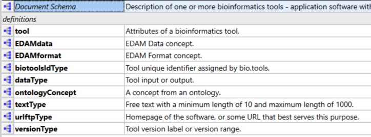

# bioagentsj.json

Here you'll find *bioagentsj.json* - the JSON schema version of [bioagents schema](https://github.com/bio-agents/bioagents-schema) - a data model for describing computational agents in life sciences.

Production
----------

bioagentsj.json mirrors bioagents schema XML schema (XSD) as closely as possible where possible and desirable:

* XML elements [1] are preserved as JSON properties
* XML element structure / nesting is preserved (whilst discarding XSD design patterns not applicable in JSON schema)
* XML element names are preserved as JSON property names
* XML comments are preserved in JSON ```title```, ```description``` and ```$comment``` properties.

[1] In bioagents schema 3.3.0 "organisational" elements (whose purpose was only to structure the schema) were discarded: ```summary```, ```labels```

Structure
---------

To make bioagentsj.json easy to understand and maintain, it uses JSON schema [definitions and references](https://cswr.github.io/JsonSchema/spec/definitions_references/) for objects, and properties with regex patterns, which are re-used in the schema:
<p align="center">

</p>

Of these, **agent** is the top-level object. **dataType** and **ontologyConcept** are defined but not actually used (they're retained for now in case they find future use).  All the others are definitions that are refered to in multiple places within the schema.

Documentation (for latest stable version)
-----------------------------------------

Technical docs formatted for website are maintained in [bioagents schemaJ repo](<https://github.com/bio-agents/bioagents> schemaJ) and hosted [here](<http://bio-agents.github.io/bioagents> schemaJ) (uses files copied from "stable" folder)

# Files

File                            | Description
----                            | -----------
bioagentsj.json                  | bioagents schema (JSON schema)
LICENSE                         | Schema license information
assets                          | Folder for images and other assets
assets/bioagents schema_json.xsd  | Ignore (bioagents schema 3.2.0 (XSD schema) produced for initial reverse-engineering of the JSON schema)
stable                          | (not used yet) - current stable version of the schema
versions                        | (not used yet) - older stable versions of the schema
README.md          | This file
